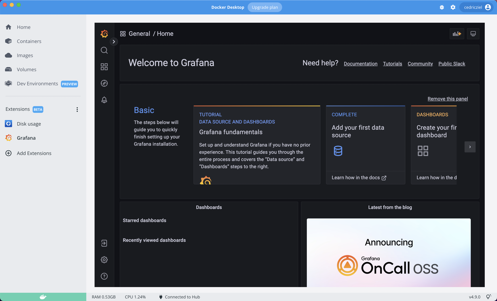

# Grafana LGTM Docker Desktop extension

This repository contains a docker desktop extension to embed the LGTM stack
into Docker Desktop (DD).

```bash
docker extension install cedricziel/dd-extension-lgtm:dev
```

**NOTE:** This project is not affiliated with Grafana Labs.



## What's in the box?

This extension ships a pre-configured LGTM stack:

* Loki as a store for logs
* Grafana as a flexible dashboarding/query tool
* Tempo as a store for tracing
* Mimir as a metric store
* OpenTelemetry collector as the point of ingress

## FAQ

1. Where is the data?

The data is currently stored in the respective containers.

2. How can I reset the state?

You can uninstall and re-install the extension.

## License

MIT
